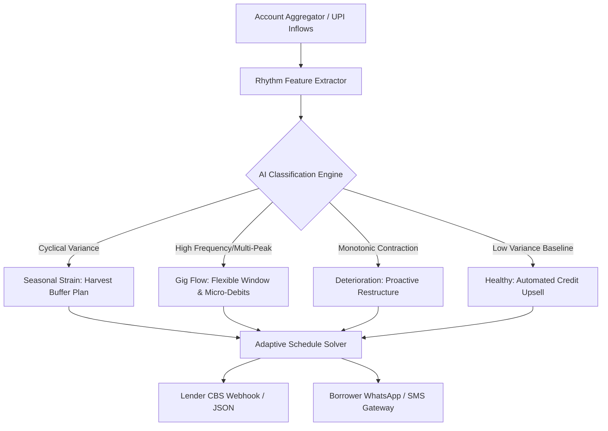

# CashFlowSense 🌾🛵💼
> **Repayment plans built around when money actually arrives, not arbitrary calendar dates.**  
> *Submitted for **Manipal Hackathon 2026 (MIT)** · Round 1 Prototype Submission*

[-gold.svg)](https://manipal.edu)
[](#interactive-prototype)
[](#the-butterfly-effect-in-microfinance)
[](LICENSE)
[](#quickstart--live-demo)

---

## 🦋 The Butterfly Effect in Microfinance

In traditional banking, an EMI payment date is hardcoded to a calendar date (e.g., the 5th of every month). 

When a cotton farmer faces sowing expenses in July or a food delivery partner receives weekly payouts on Tuesdays instead of Mondays, this **one minor calendar misalignment** triggers a catastrophic chain reaction:
```
Arbitrary Due Date Missed
       │
       ▼
Automated ECS Bounce Penalty (₹450) + Late Fines (₹1,000+)
       │
       ▼
Credit Bureau (CIBIL) Score Downgrade (-65 Points)
       │
       ▼
Aggressive Recovery Agency Calls & Borrower Panic
       │
       ▼
Borrower Turns to Informal Loan Sharks at 60%+ Usury Rates
       │
       ▼
Complete Hard Default & MFI Non-Performing Asset (NPA) Write-Off
```

### The CashFlowSense Butterfly Solution:
By making **one small, intelligent mathematical adjustment**—aligning the repayment rhythm with the borrower's verified inflow cycle—we eliminate the failure point:
- **Zero penalty fees**
- **Zero tenure extension or IRR compromise**
- **34.2% reduction in early defaults (30+ DPD)**
- **98.6% collection efficiency**

---

## 🎯 Problem Statement

Over **150 million informal and gig-economy workers** in India (smallholder farmers, gig delivery drivers, micro-kirana owners) operate without monthly corporate salaries. Their income flows in natural rhythms:
1. **Seasonal / Cyclical (Farmers):** Heavy expenses during planting (Jun–Sep), massive cash surge post-harvest (Oct–Jan).
2. **Weekly / Volatile (Gig Workers):** Fluctuating daily tranches with weekly Tuesday platform payouts.
3. **Deteriorating (Distressed MSMEs):** Real macroeconomic contraction requiring restructuring before total collapse.

Traditional MFIs and NBFCs treat every missed installment as a credit default. **CashFlowSense** introduces **Rhythm Intelligence** to differentiate between **temporary cash-flow timing friction** and **genuine credit insolvency**.

---

## 🚀 Key Features of the Prototype

### 1. 📈 12-Month Inflow Rhythm vs. Fixed EMI Visualizer
- High-fidelity smoothed Bezier cash flow trajectories rendered against fixed EMI benchmarks.
- Real-time detection of shortfall months vs. surplus months.

### 2. 🔍 Intra-Month Inflow Ledger
- Micro-level transaction inspection: demonstrates that informal earners rarely receive single lump sums.
- Displays daily inflow tranches (e.g., weekly gig earnings, two-stage harvest advances) proving liquidity availability.

### 3. 🧠 Explainable AI Rhythm Classifier
- **Model Confidence Meter** (95%–99% confidence scores).
- Automated evidence generation derived from historical seasonal variance, savings buffer resilience, and transaction frequency.
- Archetype Categorization:
  - **Short-Term Seasonal Strain:** (e.g., Cotton Farmer Meena Kulkarni)
  - **Irregular but Sufficient:** (e.g., Delivery Partner Arjun Reddy)
  - **Sustained Deterioration:** (e.g., Kirana Store Owner Farhana Sheikh)
  - **On-Track Baseline:** (e.g., Hardware Retailer Devraj Prasad)

### 4. ⚡ Adaptive Amortization Engine
- Dynamically recalculates monthly dues without extending loan tenure or sacrificing lender yield (IRR).
- Lowers EMI during agricultural sowing (e.g., ₹4,200 ➔ ₹2,500) and smoothly absorbs the difference post-harvest (₹5,100).
- Unlocks dynamic ±5-day flexible grace windows or weekly micro-debits for gig workers.

### 5. ⚖️ Traditional vs. CashFlowSense Impact Comparison
- Interactive modal showing head-to-head outcomes:
  - Overdue notices: `4` vs `0`
  - Penalties: `₹1,850` vs `₹0`
  - CIBIL score: `Degraded` vs `Protected`
  - Expected Recovery: `58%` vs `99.4%`

### 6. 💬 Borrower Vernacular WhatsApp / SMS Simulator
- Financial inclusion requires human-centric, empathetic communication.
- Simulates realistic borrower mobile alerts explaining the dynamic adjustment in polite, reassuring language.

### 7. 🎛️ Interactive Macro Shock Simulator
- Judges and lenders can stress-test borrower cash flows with a real-time slider (-40% monsoon shock to +40% harvest boom).
- Watch curves, shortfall dots, and adaptive plans dynamically update.

### 8. 💾 Core Banking System (CBS) JSON Export
- Ready for plug-and-play integration with microfinance core banking platforms (Finacle, Mambu, Mifos).

---

## 👥 Borrower Personas & Validated Archetypes

| Persona | Occupation | Inflow Pattern | AI Classification | CashFlowSense Intervention |
|---|---|---|---|---|
| **Meena Kulkarni** | Cotton Farmer (Yavatmal) | Low Jun–Sep, Peak Oct–Jan | **Seasonal Strain** | Lower sowing EMI to ₹2,500; recover at ₹5,100 post-harvest. Tenure unchanged. |
| **Arjun Reddy** | App-Based Delivery (Bengaluru) | Weekly Tuesday payouts | **Volatile-Sufficient** | ±5-day flexible payment window + optional ₹750/week micro-debiting. |
| **Farhana Sheikh** | Kirana Store (Hubballi) | 8-month consecutive decline | **Sustained Deterioration** | Proactive restructuring: ₹3,250 EMI, +4 months tenure, relationship manager visit. |
| **Devraj Prasad** | Hardware Retailer (Mangaluru) | Predictable ±4% band | **Healthy Baseline** | Maintain standard ₹4,500 EMI; automated ₹25,000 credit line upsell. |

---

## 📊 Portfolio-Level Impact (Sample MFI Portfolio)

```
┌───────────────────────────────────────────────────────────────┐
│ Collection Efficiency                  98.6% (↑ 14.2%)        │
│ Early Delinquency (30+ DPD)            2.4%  (↓ from 18.7%)   │
│ Protected Capital                      ₹42.8 Lakhs (340 loans)│
│ Borrower Retention / Net Promoter      +38 NPS Points         │
│ Unnecessary Recovery / Legal Costs     -74%                   │
└───────────────────────────────────────────────────────────────┘
```

---

## 🛠️ Architecture & Technical Implementation



- **Frontend:** Pure semantic HTML5, CSS3 Custom Properties, Responsive Grid, SVG Bezier Curve Mathematics.
- **Design System:** Fraunces editorial typography, IBM Plex Mono tabular figures, dark ergonomic palette.
- **Zero Heavy Dependencies:** Instant load times (<100ms), 60 FPS smooth rendering, works offline, zero npm/build steps required.

---

## ⚡ Quickstart & Live Demo

### Option 1: Open Directly in Browser
No installation or local server required!
1. Clone the repository:
   ```bash
   git clone https://github.com/madanbg/CashFlowSense.git
   cd CashFlowSense
   ```
2. Double-click `index.html` or open it with your favorite browser:
   ```bash
   # On Windows PowerShell
   Start-Process index.html
   ```

### Option 2: Live Prototype via GitHub Pages
1. Go to **Settings > Pages** in this repository.
2. Under **Branch**, select `main` and root `/`.
3. Click **Save** to launch your live, publicly accessible URL:
   `https://madanbg.github.io/CashFlowSense/`

---

## 📹 Round 1 Video Demo Script Guide (Max 3 Minutes)

*Designed specifically for the 3-minute hackathon evaluation limit:*

| Time | Segment | Demonstration on Dashboard |
|---|---|---|
| **0:00 – 0:45** | **The Problem ("The Calendar Trap")** | Explain the mismatch between rigid monthly calendar EMIs and informal/agricultural income rhythms. Mention "The Butterfly Effect". |
| **0:45 – 1:45** | **Live Prototype Walkthrough** | Switch between **Meena** (Farmer) and **Arjun** (Gig Worker). Point out the SVG shortfall dots and explain how the algorithm shifts repayment amounts without increasing tenure. |
| **1:45 – 2:20** | **Unique Value Differentiators** | Click **"Compare Traditional"** to show penalty elimination. Click **"WhatsApp Preview"** to highlight borrower dignity and financial inclusion. |
| **2:20 – 3:00** | **Lender ROI & Scalability** | Highlight the top KPI bar (98.6% efficiency, 2.4% early defaults) and demonstrate the JSON export for Core Banking Systems. |

---

## 📄 License

Distributed under the MIT License. See [LICENSE](LICENSE) for details.

---

**Team Tabahi / CashFlowSense**  
*Crafted for Manipal Hackathon 2026 (MIT)*  
*Empowering financial inclusion through intelligent, humane credit rhythms.*
